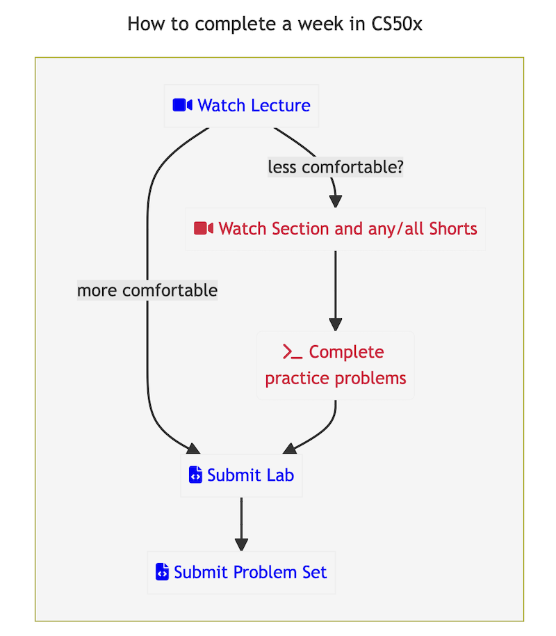

## Hints for CS50x 

### Getting Started

### Writing Code

David introduces the CS50 Codespace at the beginning of Lecture 1.    If you are a beginner, please do not try to set up your own computer to do the course but use the CS50 Codespace as David does throughout the course.  You will save yourself a lot of headaches. 🙂

Here's the  link to open the [Codespace](https://code.cs50.io/)

And here's the part of the lecture where he introduces it, in case you missed it and want to revisit.

### Compiling your programs

#### FAQ:  I'm trying to compile my program and I get " no rule to make target 'population' "  How do I fix that? 

You probably see a prompt in your terminal with just `$` which indicates that you have not attached your terminal to the folder/directory where you have saved your `population.c` source code.  Be sure to `cd population` to move into that folder first.  You can then confirm your file is there by running ls and you should see `population.c`.  Now, you can run `make population` to compile your program.

Here's a clip from lecture 1 where David illustrates this issue, if you'd like to review:

### Problem Set 2 - Caesar

[FAQ: I don't understand the Caesar formula and how the modulo 26 fits in.  Why do we use that?](caesar-formula.md)

[FAQ: Caesar check50 says I'm failing, but it looks right to me](caesar-check50.md)

### Problem Set 3 - Tabulate

[FAQ: I'm not sure how the whole Tabulate process is meant to work in Runoff. I've watched the Walkthrough but I'm still confused!](tabulate.md)

### Problem Set 4 - Filter

You may find it easier to debug your filters using a smaller bitmap file than the ones given in the distribution code.

* A small 3x3 bitmap(`wget http://github.com/curiouskiwi/cs50x-help/raw/master/3x3.bmp`) 
* A small 3x3 bitmap for Edges(`wget http://github.com/curiouskiwi/cs50x-help/raw/master/3e.bmp`)
* A small 4x4 bitmap(`wget http://github.com/curiouskiwi/cs50x-help/raw/master/4x4.bmp`)
* A small 4x4 bitmap for Edges(`wget http://github.com/curiouskiwi/cs50x-help/raw/master/4e.bmp`)

### Problem Set 4 - Recover

[FAQ: What does that final condition in the JPG signature check mean?](bitwise.md)

### Lab 5 - Inheritance

[FAQ: I don't get how you use recursion to free the entire family?](freefamily.md)

### Problem Set 5 - Speller

A simple [hash function you can try](hash.c)

### Problem Set 7 - Finance

Sometimes you may want to test your quote/buy/sell/index functions using prices/stocks that you know won't change.  Or, the IEX API may be acting up and isn't returning any values.  In these cases, a temporary `lookup` function in `helpers.py` works well.  Open `helpers.py` and comment out the `lookup` function and then paste in this [lookup function for testing](lookup_finance.md).

## Final Project

Be sure that your README.md is comprehensive enough, per the requirements shown in the specification.  Here's an [example of a project README file](finalproject_sampleREADME.md) that I did for my own project years ago. 

## Other Concepts you might need to know

I created a string like `string word = "hello";`[Why do I segfault when trying to change a character in that string?](stringliteral.md)

## Just for Fun ##

Wondering how to display the binary representation of a hex number?  Here's my [hex to binary converter in C](hexbin.c).
